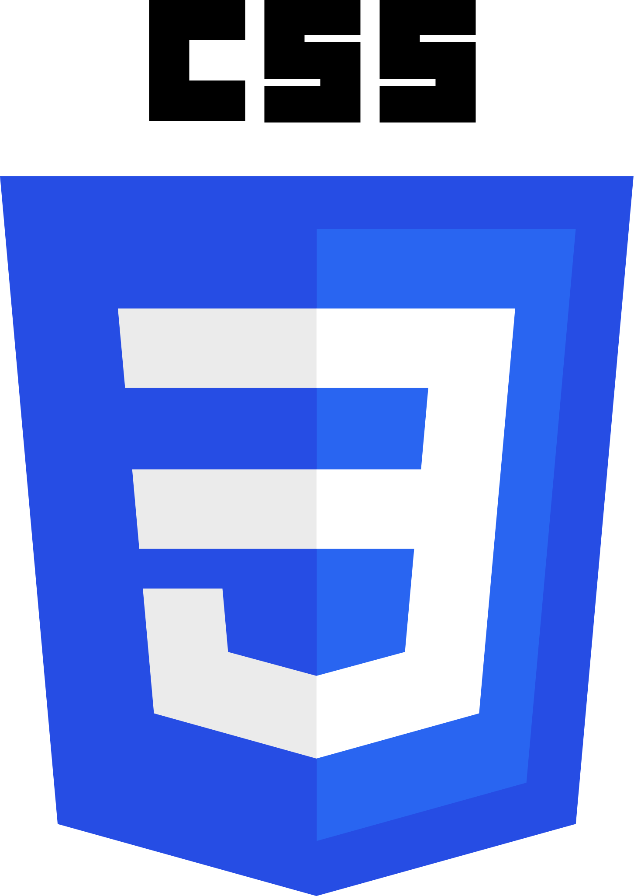
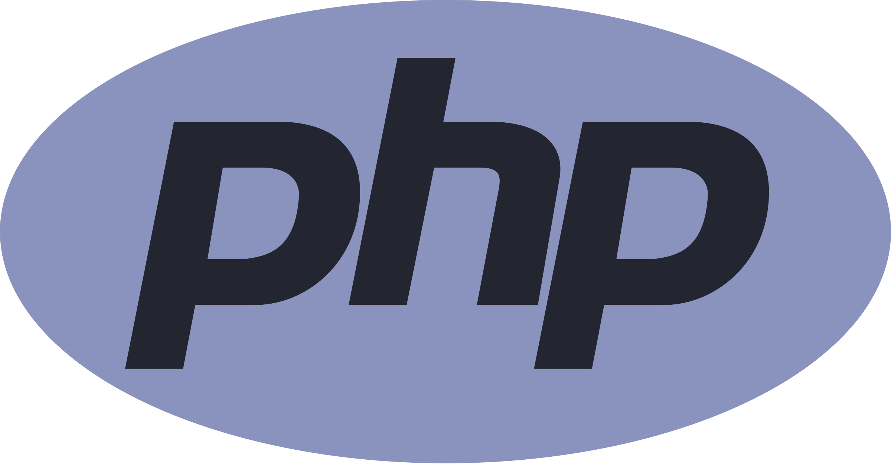
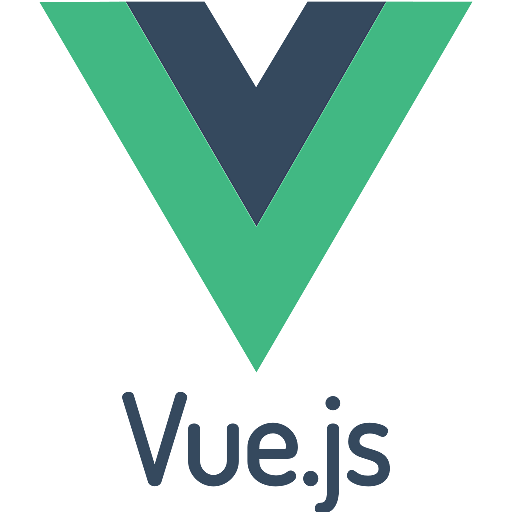
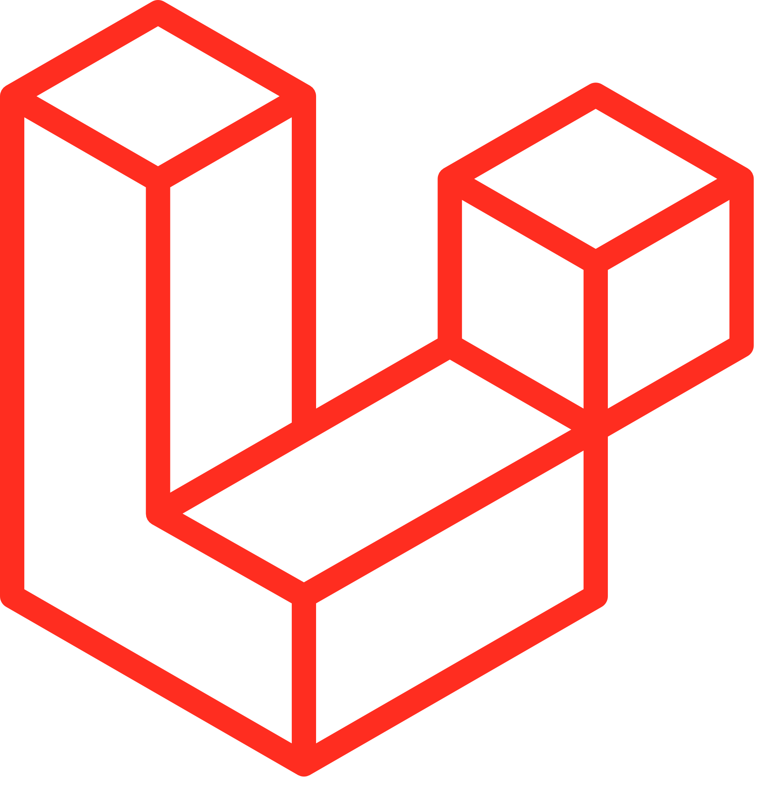

### Hello, Github Traveler! 🤙🏼🤙🏼

My name's Yuri Montesi
I started learning coding in April and I'm trying to improve everyday at it.

🌐 At the moment my known languages are: 🌐

- Html          
- Css           
- Sass          
<!-- - Javascript     -->
- Php           

⚙️ I usually work with these frameworks: ⚙️

- Vue           
- Laravel       
<!-- - Tailwind       -->
- Bootstrap     

